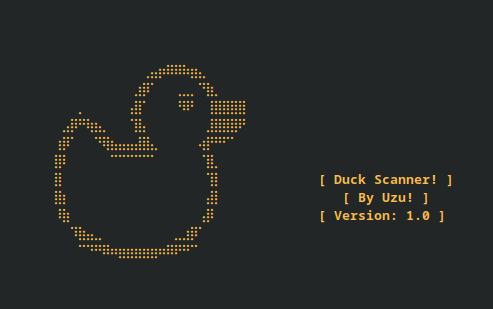

# 🦆 Welcome to Duck Scanner Repository!

- Duck Scanner is a simple port scanner developed in C.

> [!IMPORTANT]
> Because it is developed in C, this simple port scanner is very fast.

1. `To compile you can use` ***`GCC`*** `or a compiler of your choice:`  
    - `gcc Duck_Scanner.c -o Duck_Scanner`   

2. `Current versions:`
    - [x] **1.0** 👍

    
      
    

